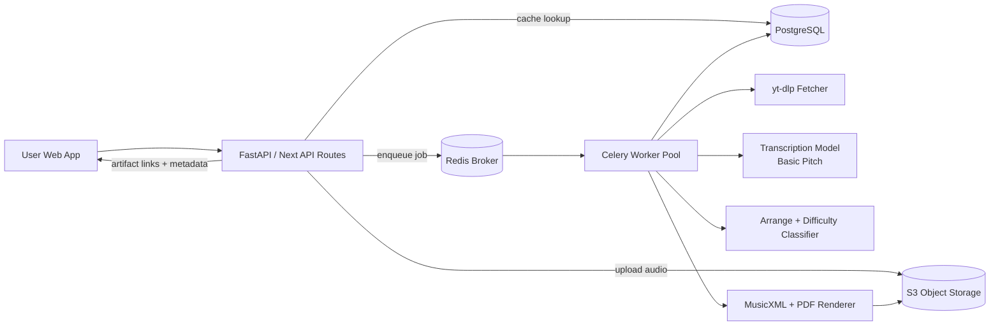

# Oh Sheet MVP PRD + Technical Architecture

## Executive Summary

Oh Sheet converts a YouTube link or uploaded audio file into piano sheet music and stores the result in a community library.

The MVP focuses on three outcomes:
- Users can submit audio and get downloadable `PDF` + `MusicXML`.
- Processing is asynchronous so users do not wait on a blocked request.
- Repeated YouTube submissions hit a cache and return existing results quickly.

This reduces compute cost and creates compounding product value because every successful transcription becomes a reusable library entry.

## Product Goals and Success Metrics (2-Week Target)

- **Primary business goal:** deliver a deployed AI product with real users.
- **Commercial/community goal:** reach either 50 paying users or 100 GitHub stars in 14 days.
- **MVP usage metrics:**
  - Job success rate >= 90% for accepted inputs.
  - P50 end-to-end completion <= 90 seconds for <= 5 minute songs.
  - Cache hit rate >= 20% by week 2.
  - 7-day retention for trial users >= 20%.

## User Personas

- **Music learner (Beginner-Intermediate):**
  - Wants recognizable songs as simplified piano sheets.
  - Cares about fast turnaround and clear difficulty labels.
- **Content creator / teacher:**
  - Needs quick lead-sheet style outputs for lessons.
  - Cares about editable formats (`MusicXML`) and reuse.
- **Hobby arranger / power user:**
  - Uploads many tracks and compares variants.
  - Cares about searchable history and quality controls.

## Detailed Functional Requirements

### 1) Audio Ingestion

- Accept:
  - YouTube URL (parsed to canonical `youtube_id`).
  - Direct upload (`mp3`, `wav` for MVP).
- Validate:
  - Duration limits (configurable max length).
  - File format and basic metadata probe.
- Store:
  - Original audio object in object storage.
  - Ingestion metadata in database.

### 2) AI Transcription Engine

- Pipeline:
  1. Normalize audio (sample rate/channels).
  2. Transcribe to MIDI (Basic Pitch).
  3. Convert MIDI to score representation.
  4. Render to `MusicXML` and `PDF` (Music21 + LilyPond/MuseScore fallback).
- Quality controls:
  - Confidence score on tracks.
  - Warning flags for low-note or low-confidence outputs.

### 3) Library Cache

- Cache key strategy:
  - Primary key: canonical `youtube_id` + pipeline_version + difficulty_target.
  - Secondary key for uploads: `audio_sha256` + pipeline_version + difficulty_target.
- Behavior:
  - If a completed, policy-compliant entry exists, return artifacts immediately.
  - If job is already processing for same key, attach user to existing job status.

### 4) Difficulty Classification

- Output integer level `1-10`.
- Base heuristic features:
  - Note density (notes per second/beat).
  - Peak simultaneous notes per hand.
  - Hand span estimate (max interval in semitones).
  - Rhythmic complexity (syncopation + tuplet-like density proxy).
  - Tempo-adjusted challenge factor.
- Classifier:
  - Weighted rules in MVP.
  - Future: train regressor/classifier from rated corpus.

### 5) Searchable Community Repository

- Users can browse and search by:
  - Title, artist, source type, difficulty, duration, tags.
- Users can filter and sort:
  - Newest, most downloaded, easiest, hardest.
- Each library item shows:
  - Preview metadata, artifacts, and provenance (source hash / youtube_id).

## Non-Functional Requirements

- Async reliability: idempotent jobs, retries, dead-letter queue.
- Cost control: hard duration limits, cache-first checks, duplicate suppression.
- Security: signed URLs, upload validation, per-user rate limits.
- Observability: job stage timings, failures by stage, queue depth.

## Technical Stack Recommendation

- **Frontend:** Next.js (web app + landing + pricing + auth flows).
- **API Gateway/App:** FastAPI (job submission, search API, auth-protected routes).
- **Worker Service:** Python worker (Celery + Redis) for transcription/engraving.
- **Database:** PostgreSQL (metadata, users, jobs, library index).
- **Object Storage:** AWS S3 (audio inputs + artifacts).
- **Queue/Broker:** Redis (Celery broker/results).
- **Search (MVP):** PostgreSQL full-text + trigram; optional OpenSearch later.
- **Auth/Billing:** Clerk/Auth.js + Stripe.
- **Infra:** Render/Fly/ECS for app + worker, managed Postgres + Redis, S3.

## Data Schema (MVP)

```sql
-- users
users (
  id uuid pk,
  email text unique not null,
  created_at timestamptz not null default now()
);

-- transcription jobs
jobs (
  id uuid pk,
  user_id uuid references users(id),
  source_type text not null check (source_type in ('youtube','upload')),
  youtube_id text null,
  audio_sha256 text null,
  status text not null check (status in ('queued','running','succeeded','failed')),
  pipeline_version text not null,
  difficulty_level int null check (difficulty_level between 1 and 10),
  error_message text null,
  created_at timestamptz not null default now(),
  updated_at timestamptz not null default now()
);

create index idx_jobs_youtube_id on jobs(youtube_id);
create index idx_jobs_audio_sha on jobs(audio_sha256);

-- canonical score/library entries (cache target)
library_scores (
  id uuid pk,
  source_type text not null check (source_type in ('youtube','upload')),
  youtube_id text null,
  audio_sha256 text null,
  title text,
  artist text,
  duration_sec numeric,
  difficulty_level int not null check (difficulty_level between 1 and 10),
  pipeline_version text not null,
  pdf_s3_key text not null,
  musicxml_s3_key text not null,
  midi_s3_key text null,
  visibility text not null default 'public' check (visibility in ('public','private','unlisted')),
  created_by uuid references users(id),
  created_at timestamptz not null default now(),
  unique (youtube_id, pipeline_version, difficulty_level),
  unique (audio_sha256, pipeline_version, difficulty_level)
);

-- search acceleration
alter table library_scores add column search_tsv tsvector;
create index idx_library_scores_tsv on library_scores using gin(search_tsv);
create index idx_library_scores_difficulty on library_scores(difficulty_level);
```

## Processing Pipeline and Job Queue

1. Client submits URL/upload request to API.
2. API computes canonical source key (`youtube_id` or `audio_sha256`).
3. API checks `library_scores` for cache hit.
4. On hit: return existing artifact metadata immediately.
5. On miss:
   - Create `jobs` row with `queued`.
   - Enqueue Celery task with idempotency key.
6. Worker stages:
   - ingest -> transcribe -> arrange -> classify_difficulty -> engrave -> persist artifacts.
7. Worker stores artifacts in S3, metadata in Postgres.
8. Worker updates job to `succeeded` and emits event for UI polling/WS.

### Queue Controls

- Per-stage retries with backoff (non-deterministic infra failures only).
- Timeout per stage (e.g., transcribe 180s for MVP).
- Dead-letter queue for manual review.
- Deduplicate in-progress jobs by idempotency key.

## System Architecture Diagram (Mermaid)



## Copyright and DMCA Strategy (MVP)

- Do not promise legal ownership transfer.
- Terms require users to confirm rights/permission to process uploaded content.
- Respond to takedown requests with removal workflow:
  - Remove public listing.
  - Invalidate download links.
  - Keep internal audit log.
- Avoid storing full YouTube audio permanently unless required for processing.
- Store derivations and metadata with provenance for takedown traceability.

## AI Hallucination / Accuracy Risk Controls

- Expose confidence + warning metadata on each result.
- Allow user feedback: "wrong notes/rhythm" with quick regenerate option.
- Keep deterministic post-processing (quantization, overlap cleanup) separate from ML.
- Compare generated MIDI statistics against sanity thresholds.
- Mark output as "AI-generated draft" in UI for MVP.

## Phase 1 Roadmap (MVP, 14 Days)

- **Days 1-3**
  - Production deploy baseline (API + worker + DB + Redis + S3).
  - URL/upload ingestion and queue wiring.
- **Days 4-6**
  - End-to-end transcription and artifact rendering.
  - Cache key + hit path with canonical source mapping.
- **Days 7-9**
  - Library API (list/search/filter) + web UI.
  - Difficulty classifier v1 (heuristic).
- **Days 10-12**
  - Billing/paywall, rate limits, onboarding funnel.
  - Observability dashboards and error budget tracking.
- **Days 13-14**
  - Launch sprint: outreach, demos, onboarding calls, instrumentation review.

## Go-To-Market Notes for 50 Paying Users / 100 Stars

- Launch with "instant sheet from YouTube" demo clips.
- Offer free limited credits + paid unlimited plan.
- Publish benchmark repo and transparent quality notes to attract GitHub stars.
- Add "community upload leaderboard" to increase sharing and retention.
